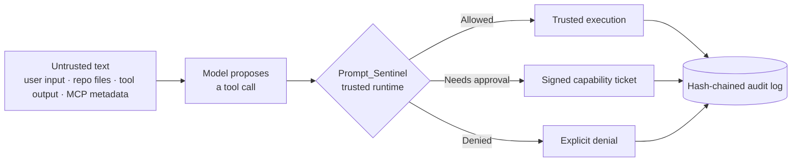
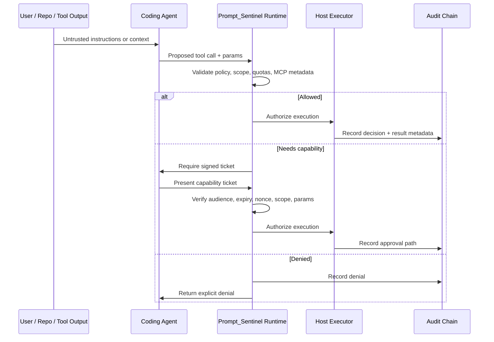
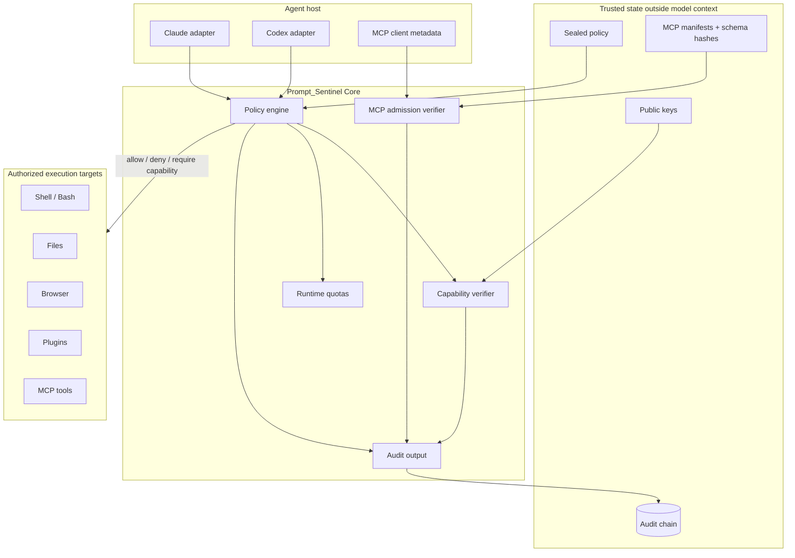
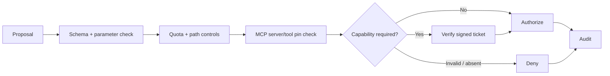
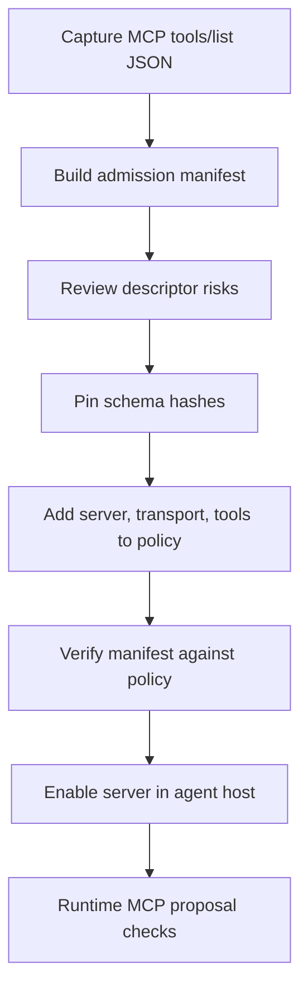

<div align="center">

# 🛡️ Prompt_Sentinel

### A trusted action boundary for coding agents

Prompt_Sentinel keeps **policy, approval, capability tickets, MCP admission, and audit decisions** in trusted host-side code — where the model can propose actions, but the runtime decides what is authorized.

<br/>


<br/>

> **The rule:** a model-generated tool call is a proposal, not an authorization.

</div>

---

## Contents

- [Why it exists](#why-it-exists)
- [How it works](#how-it-works)
- [Product shape](#product-shape)
- [Architecture](#architecture)
- [Install](#install)
- [Fast start](#fast-start)
- [CLI surface](#cli-surface)
- [MCP poisoning hardening](#mcp-poisoning-hardening)
- [Policy packs](#policy-packs)
- [Runtime guarantees](#runtime-guarantees)
- [Hooks and adapters](#hooks-and-adapters)
- [Repository map](#repository-map)
- [Schemas](#schemas)
- [Development](#development)
- [Current security posture](#current-security-posture)

---

## Why it exists

Coding agents now act across files, shells, browsers, plugins, and MCP servers. That creates a boundary problem:

> **Untrusted text can shape trusted actions.**

A repository file, tool response, retrieved web page, MCP descriptor, or user message can all contain instructions. Prompt_Sentinel treats those inputs as **untrusted influence**, not authority.

Instead of asking an LLM to protect itself, Prompt_Sentinel separates the system into explicit trust zones.



Prompt_Sentinel separates:

| Boundary | What lives there | Trust level |
|---|---|---:|
| **Input surface** | User text, repo text, retrievals, tool output, MCP descriptors | Untrusted |
| **Model layer** | Tool-call proposals, reasoning, suggested actions | Proposal only |
| **Runtime layer** | Policy checks, capability verification, MCP pinning, quotas | Trusted |
| **Execution layer** | Shell, files, browser, plugins, MCP calls | Authorized only |
| **Audit layer** | Tool decisions, denials, approvals, exports | Evidence trail |

---

## How it works

Prompt_Sentinel acts as a policy engine between the agent and the tools it wants to use.



The model can still reason, plan, and propose. It just cannot silently convert a proposal into an action.

---

## Product shape

Prompt_Sentinel is organized around three layers.

| Layer | Role | Included here |
|---|---|---:|
| **Core** | Local runtime, CLI, sealed policy handling, signed capability flow, local audit chain, Codex and Claude adapters | ✅ Implemented |
| **Guard Add-On** | Managed policy packs, approval workflows, improved denial UX, hosted audit search, team presets | 🧩 Scaffolding |
| **Enterprise** | Central policy distribution, approval services, SSO/RBAC, SIEM export, KMS/HSM integration, long-retention compliance reporting | 🧩 Scaffolding |

This repository implements the **Core runtime** directly and includes Guard and Enterprise scaffolding under `AGENT_CORE/`.

---

## Architecture



### Decision lifecycle



---

## Install

From the repository root:

```bash
pip install -e .
```

That installs the `prompt-sentinel` CLI while sourcing the runtime package from:

```text
AGENT_CORE/prompt-sentinel-claude/prompt-sentinel-core/src
```

---

## Fast start

Validate a policy:

```bash
prompt-sentinel policy validate --policy policy.json
```

Summarize a policy:

```bash
prompt-sentinel policy summary --policy policy.json
```

Check a proposed tool call:

```bash
prompt-sentinel check-proposal --policy policy.json --proposal proposal.json
```

Check and execute through the trusted path:

```bash
prompt-sentinel check-proposal --policy policy.json --proposal proposal.json --execute
```

Inspect the audit trail:

```bash
prompt-sentinel audit tail --audit-log prompt_sentinel.audit.jsonl --limit 10
```

---

## CLI surface

### Core policy and proposal checks

```bash
prompt-sentinel check-proposal --policy policy.json --proposal proposal.json
prompt-sentinel check-proposal --policy policy.json --proposal proposal.json --execute
prompt-sentinel policy validate --policy policy.json
prompt-sentinel policy summary --policy policy.json
```

### Signed capability flow

Issue a capability ticket:

```bash
prompt-sentinel issue-capability \
  --authority policy_engine \
  --audience local.prompt-sentinel \
  --operation approve_tool_call \
  --session-id sess-1 \
  --scope scope.json \
  --params params.json \
  --private-key keys/dev.key
```

Verify a capability ticket:

```bash
prompt-sentinel verify-capability \
  --capability ticket.json \
  --public-key keys/dev.key.pub \
  --params params.json \
  --session-id sess-1 \
  --operation approve_tool_call \
  --scope scope.json
```

### Audit inspection and export

```bash
prompt-sentinel audit tail --audit-log prompt_sentinel.audit.jsonl --limit 10
prompt-sentinel audit export --audit-log prompt_sentinel.audit.jsonl --destination stdout
```

Backward-compatible aliases still exist for:

```text
policy-summary
policy-validate
audit-tail
audit-export
```

---

## MCP poisoning hardening

Prompt_Sentinel includes an MCP admission and pinning layer. It treats MCP server metadata, tool descriptors, tool schemas, tool arguments, and tool output as untrusted until the trusted runtime verifies them.

### Threat coverage

| MCP risk | Prompt_Sentinel control |
|---|---|
| Poisoned tool descriptions or schemas | Descriptor review + schema hash pinning |
| Server rug-pulls after approval | Manifest verification before enablement |
| Unapproved tools appearing in `tools/list` | Policy-pinned server/tool admission |
| Unsafe STDIO server launches | Command allowlist + shell/metacharacter denial |
| Cross-server data laundering | Explicit `mcp_data_flows.allowed` edges |
| Tool output triggering follow-up secret reads | Output risk scanning + audit/review path |
| Capability confusion | Expected operation, scope, params, and session checks |

### MCP admission workflow



Build a manifest for a streamable HTTP MCP server:

```bash
prompt-sentinel mcp build-manifest \
  --tools finance.tools.json \
  --server-id finance \
  --publisher example \
  --transport streamable-http \
  --server-url https://finance.example/mcp \
  --output finance.manifest.json
```

Verify the manifest:

```bash
prompt-sentinel mcp verify-manifest \
  --manifest finance.manifest.json \
  --policy policy.json
```

For STDIO MCP servers, the manifest and policy can include the launch command:

```bash
prompt-sentinel mcp build-manifest \
  --tools local.tools.json \
  --server-id local-search \
  --transport stdio \
  --command python \
  --arg -m \
  --arg local_search_server \
  --output local-search.manifest.json
```

STDIO launch policy denies shell usage, unsafe metacharacters, and commands that are not allowlisted.

---

## MCP policy fields

MCP policy is expressed alongside normal tool permissions.

```json
{
  "tool_permissions": {
    "Bash": {
      "allowed_params": ["command", "cmd", "input", "stdin", "description"],
      "max_calls_per_session": 25
    }
  },
  "mcp_transport": {
    "stdio": {
      "allowed_commands": ["python", "python3", "node", "npx", "uvx"]
    }
  },
  "mcp_servers": {
    "finance": {
      "enabled": true,
      "transport": "streamable-http",
      "url": "https://finance.example/mcp",
      "publisher": "example",
      "trust_tier": "trusted",
      "tools": {
        "lookup_invoice": {
          "schema_hash": "REPLACE_WITH_MANIFEST_SCHEMA_HASH",
          "allowed_params": ["invoice_id"],
          "max_calls_per_session": 5
        }
      }
    },
    "enrichment": {
      "enabled": true,
      "transport": "streamable-http",
      "url": "https://enrich.example/mcp",
      "publisher": "third-party",
      "trust_tier": "third-party",
      "tools": {
        "lookup_invoice": {
          "schema_hash": "REPLACE_WITH_MANIFEST_SCHEMA_HASH",
          "allowed_params": ["invoice_id"]
        }
      }
    }
  },
  "mcp_data_flows": {
    "allowed": [
      {"from": "finance", "to": "enrichment"}
    ],
    "blocked": []
  }
}
```

By default, data from one MCP server cannot be passed into a third-party or untrusted MCP server unless `mcp_data_flows.allowed` explicitly permits that edge.

---

## Runtime MCP calls

Host adapters should name MCP tools with one of the supported forms:

```text
mcp__<server_id>__<tool_name>
mcp:<server_id>:<tool_name>
```

MCP proposals should include metadata when available:

```json
{
  "tool": "mcp__finance__lookup_invoice",
  "params": {
    "invoice_id": "INV-1"
  },
  "metadata": {
    "schema_hash": "REPLACE_WITH_MANIFEST_SCHEMA_HASH",
    "input_origins": []
  }
}
```

`input_origins` is used for cross-server data-flow checks. Tool output is also scanned for prompt-like follow-up instructions and sensitive payload patterns so poisoned responses can be audited and reviewed.

---

## Policy packs

The packaged runtime ships with starter policy packs.

| Pack | Path | Use |
|---|---|---|
| Core default | `AGENT_CORE/prompt-sentinel-claude/prompt-sentinel-core/src/prompt_sentinel/policies/default-policy.json` | Local default runtime policy |
| Guard team | `AGENT_CORE/prompt-sentinel-claude/prompt-sentinel-core/src/prompt_sentinel/policies/guard-team-policy.json` | Team-oriented presets |
| Enterprise default | `AGENT_CORE/prompt-sentinel-claude/prompt-sentinel-core/src/prompt_sentinel/policies/enterprise-default-policy.json` | Enterprise control-plane baseline |

These policies cover:

- Tool allowlists and parameter allowlists
- Path controls and quotas
- Sensitive action classes
- Approval scopes and operations
- MCP transport rules, server pins, and data-flow rules
- Audit retention classes
- Inheritance hooks for managed policy layering

---

## Runtime guarantees

Prompt_Sentinel's strongest guarantees are host-enforced.

| Guarantee | Why it matters |
|---|---|
| **Sealed policy stays outside model context** | The model cannot rewrite the rules that govern its tools. |
| **Signed capability tickets bind approval context** | Approvals are tied to session, audience, expiry, nonce, operation, scope, and exact parameters. |
| **Every tool decision is audit-chained** | Allows review of allowed, denied, and capability-mediated actions. |
| **MCP servers and tools require admission** | Tools are enabled only after manifest and policy checks. |
| **Policy denials are explicit** | Unsafe actions are not silently worked around. |

---

## Hooks and adapters

Claude and Codex adapters call the shared runtime helpers instead of duplicating authorization logic.

The Claude hook matcher covers standard local tools and MCP tool names:

```text
Bash|Edit|Write|mcp__.*|mcp:.*
```

Hooks evaluate proposals with `execute=false`, which lets the host deny unsafe MCP/tool proposals without executing them locally. Trusted execution remains a separate runtime step.

---

## Repository map

| Path | Purpose |
|---|---|
| `AGENT_CORE/prompt-sentinel-claude/prompt-sentinel-core/` | Authoritative installable runtime and CLI used by the root package |
| `AGENT_CORE/prompt-sentinel-codex/` | Codex plugin and skill distribution layer |
| `AGENT_CORE/prompt-sentinel-control-plane/` | Enterprise control-plane skeleton and schemas |
| `AGENT_CORE/prompt-sentinel-core/` | Standalone runtime copy kept in sync for packaging/distribution work |
| `V1_Prompt_Sentinel/prompt-sentinel-core/` | V1 package copy kept in sync for compatibility |
| `V3_LLM_Boundary_Crypto_end_to_end.py` | Original end-to-end prototype kept as a runnable reference |
| `deployment_guide.md` | Framework integration examples for LangChain, LlamaIndex, and FastAPI |

---

## Schemas

Installable schemas ship with the runtime package:

- Policy bundle schema
- Capability ticket schema
- Audit export record schema

See:

```text
AGENT_CORE/prompt-sentinel-claude/prompt-sentinel-core/src/prompt_sentinel/schemas/
```

Enterprise-facing schemas remain under:

```text
AGENT_CORE/prompt-sentinel-control-plane/schemas/
```

---

## Development

Run focused tests from the repository root:

```bash
python -m pytest AGENT_CORE/prompt-sentinel-claude/prompt-sentinel-core/tests -q
python -m pytest AGENT_CORE/prompt-sentinel-core/tests -q
python -m pytest V1_Prompt_Sentinel/prompt-sentinel-core/tests -q
```

The original V3 demo remains useful for concept validation:

```bash
python V3_LLM_Boundary_Crypto_end_to_end.py
```

---

## Current security posture

The project is partially hardened against MCP poisoning in the places this repository controls.

### Hardened now

- MCP admission manifests pin full tool descriptors by hash.
- Policy verifies approved servers, transports, tools, and schema hashes.
- STDIO launch rules reject shell-style command execution.
- Runtime checks enforce MCP parameter allowlists and call quotas.
- Cross-server data flows are explicit.
- Tool output risk is audited.

### Host integration still required

Remaining hardening depends on the agent host. The host must:

- Capture `tools/list` from MCP servers.
- Run manifest verification before enabling servers.
- Pass schema hash metadata on MCP calls.
- Preserve Prompt_Sentinel outside model-controlled state.
- Route execution through the trusted runtime instead of letting model output execute directly.

---

<div align="center">

### Prompt_Sentinel turns agent autonomy into governed execution.

**The model proposes. The runtime authorizes. The audit trail remembers.**

</div>
